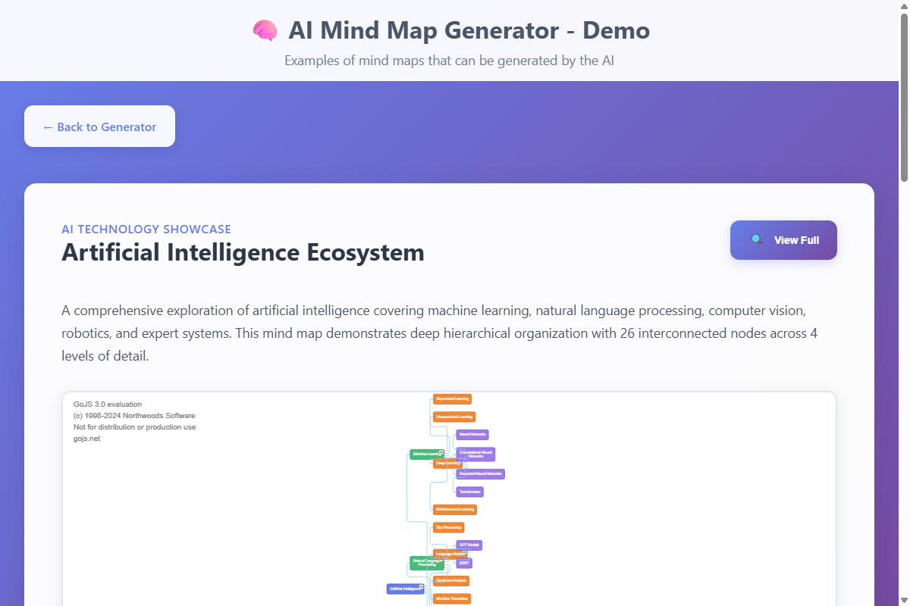
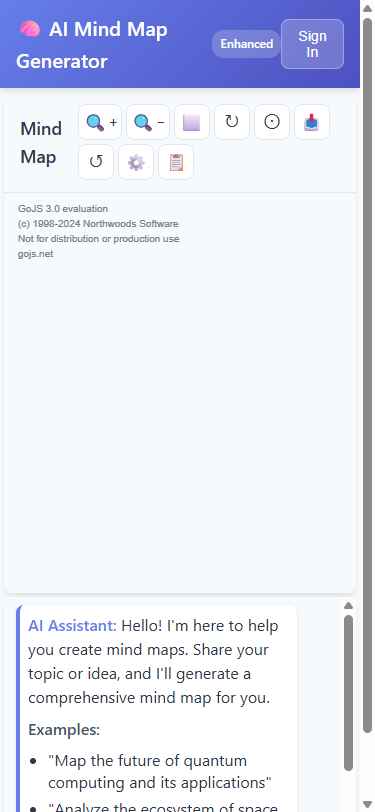

# 🧠 AI Mind Map Generator - Enhanced Edition

A comprehensive, feature-rich web application that uses multiple AI models and advanced technologies to create detailed, interactive mind maps with cloud storage, collaboration, and professional export capabilities.

## 🌟 Key Highlights

- **🤖 Multi-AI Integration**: Supports OpenAI GPT, Anthropic Claude, and Google Gemini for diverse AI-powered mind map generation
- **💬 Optimized Chat Interface**: Clean, professional chat experience with improved spacing and responsive design
- **🎯 Stable Navigation**: Robust layout management system preventing UI state issues during navigation
- **📱 Mobile-First Design**: Fully responsive interface optimized for desktop, tablet, and mobile devices
- **☁️ Cloud-Native**: Firebase-powered real-time collaboration and cloud storage
- **🔍 Advanced Search**: Fuzzy search across all mind maps with intelligent indexing
- **📊 Professional Export**: Multiple export formats including PNG, PDF, SVG, and Markdown
- **🎨 Customizable Themes**: Dark/light modes with professional styling options


## 📸 Visual Guide & Screenshots

> **📱 Live Demo Available**: Experience the full interface by running the application locally at `http://localhost:3000`
>
> **🎯 Interactive Features**: View comprehensive demos at `http://localhost:3000/demo.html`

### Main Application Interface


**Complete overview of the AI Mind Map Generator interface featuring:**

- Clean, professional chat section with optimized spacing
- Prominent "View Interactive Demos" button for easy navigation
- Mind map visualization area with GoJS-powered rendering
- Responsive design that adapts to all screen sizes

### Interactive Demo Page



**Comprehensive demo page showcasing:**

- Three different AI-generated mind maps with interactive features
- Artificial Intelligence Ecosystem (26 nodes across 4 levels)
- Blockchain Technology Deep Dive (36 nodes with technical specs)
- Sustainable City Planning Framework (40 nodes with multi-level relationships)

### Mobile Responsive Design

 

**Mobile-optimized layouts featuring:**

- Responsive chat interface with reduced padding for mobile devices
- Touch-friendly navigation and controls
- Optimized mind map viewing with pan and zoom capabilities
- Consistent user experience across desktop, tablet, and mobile devices

## ✨ Recent Improvements & Fixes

### 🎯 Navigation & Layout Stability (Latest Update)

- **✅ Fixed Navigation Button Positioning**: Resolved issue where the "View Interactive Demos" button would move from top to bottom when navigating between pages
- **✅ Stabilized Flex Layout**: Implemented CSS flex order system to ensure consistent element positioning
- **✅ Enhanced Demo Page Layout**: Improved mind map centering and responsive design across all screen sizes
- **✅ Browser Cache Resilience**: Added JavaScript event handlers for page visibility and navigation to maintain layout stability
- **✅ Cross-Device Compatibility**: Verified fixes work across desktop, tablet, and mobile devices
- **✅ Root Path Navigation**: Updated "Back to Generator" link to use clean root path navigation without explicit file references

### 💬 Chat Interface Optimization (New)

- **✅ Eliminated Excessive Whitespace**: Reduced padding and margins in chat messages area by 25% for cleaner appearance
- **✅ Improved Message Spacing**: Implemented CSS gap-based spacing system for consistent message distribution
- **✅ Optimized Height Distribution**: Adjusted chat messages container to take approximately 50% of available height for better balance
- **✅ Enhanced Typography**: Improved line heights, list formatting, and text readability within chat messages
- **✅ Mobile-Responsive Chat**: Added specific mobile optimizations for chat interface with reduced padding and spacing
- **✅ Professional Message Layout**: Streamlined message content padding and eliminated redundant line breaks

### 🎨 Visual & UX Improvements

- **✅ Centered Mind Map Visualizations**: All mind maps now properly center within their containers
- **✅ Consistent Section Alignment**: Demo sections maintain uniform spacing and alignment
- **✅ Professional Responsive Design**: Enhanced mobile and tablet layouts with proper scaling
- **✅ Improved Modal Functionality**: Fullscreen mind map modals with enhanced controls and centering
- **✅ Clean Navigation Flow**: Seamless transitions between generator and demo views without layout shifts

## 🚀 Enhanced Features

### Core AI & Generation

- 🧠 **Multi-AI Support**: OpenAI GPT, Anthropic Claude, Google Gemini
- 🔍 **Web Search Integration**: Real-time web search for current information
- 📚 **Template Library**: Pre-built templates for business, education, research
- 🎯 **Smart Suggestions**: AI-powered node suggestions and auto-completion

### Cloud & Collaboration
- ☁️ **Cloud Storage**: Firebase-powered cloud storage and sync
- 👥 **Real-time Collaboration**: Multi-user editing with live cursors
- 💬 **Comments & Annotations**: Collaborative feedback system
- 🔄 **Version History**: Track changes and rollback capabilities
- 🔐 **User Authentication**: Secure Google OAuth and email authentication

### Advanced Export & Sharing
- 📄 **Multiple Export Formats**: PNG, PDF, SVG, JSON, Markdown
- 🎨 **Custom Styling**: Professional layouts and branding options
- 🔗 **Sharing & Permissions**: Public/private sharing with role-based access
- 📱 **PWA Support**: Offline functionality and mobile app experience

### Professional Tools
- 🔍 **Advanced Search**: Fuzzy search across all mind maps and nodes
- 📊 **Analytics Dashboard**: Usage insights and mind map complexity analysis
- 🎨 **Theme System**: Dark/light modes and custom themes
- ⚡ **Auto-save**: Intelligent auto-saving with conflict resolution
- 🔌 **API Integration**: Connect with Google Sheets, Notion, Airtable

## 🚀 Quick Start

### Prerequisites

- Node.js 18+ and npm
- A modern web browser (Chrome, Firefox, Safari, Edge)
- Firebase project (for cloud features)
- AI API keys (OpenAI, Anthropic, or Google AI)
- Optional: Tavily API key for web search

### Installation

1. **Clone the repository**
   ```bash
   git clone https://github.com/amafjarkasi/mindmap-ai.git
   cd mindmap-ai
   ```

2. **Install dependencies**
   ```bash
   npm install
   ```

3. **Set up environment variables**
   ```bash
   cp .env.example .env
   # Edit .env with your API keys and Firebase config
   ```

4. **Start development server**
   ```bash
   npm run dev
   ```

5. **Open in browser**
   Navigate to `http://localhost:3000`

## 🎯 Live Demo & Features

### Interactive Demo Page

Experience the full capabilities of the AI Mind Map Generator through our comprehensive demo page:

**🔗 Demo URL**: `http://localhost:3000/demo.html` (when running locally)

#### Featured Mind Map Demonstrations

1. **🤖 Artificial Intelligence Ecosystem**
   - 26 interconnected nodes across 4 levels
   - Covers machine learning, NLP, computer vision, robotics
   - Demonstrates deep hierarchical organization

2. **⛓️ Blockchain Technology Deep Dive**
   - 36 nodes with detailed technical specifications
   - Consensus mechanisms, cryptocurrencies, smart contracts
   - Real-world applications and enterprise use cases

3. **🌱 Sustainable City Planning Framework**
   - 40 nodes showing complex multi-level relationships
   - Green infrastructure, transportation, energy management
   - Smart technologies and social equity considerations

#### Interactive Features

- **🔍 Fullscreen Modal Views**: Click "View Full" to explore mind maps in detail
- **🎮 Interactive Navigation**: Pan, zoom, and explore each mind map
- **📱 Responsive Design**: Optimized for desktop, tablet, and mobile devices
- **🔄 Seamless Navigation**: Smooth transitions between main app and demo page

### Key User Interface Components

#### Main Application Interface


**Chat Section Features:**

- AI assistant with helpful examples and guidance
- Prominent "View Interactive Demos" button for easy access
- Clean, intuitive input area for mind map generation
- Real-time feedback and error handling

#### Mind Map Generation Area


**Visualization Features:**

- Professional GoJS-powered mind map rendering
- Interactive zoom, pan, and navigation controls
- Export capabilities for PNG, PDF, and other formats
- Responsive layout that adapts to content size

#### Demo Page Layout


**Demo Page Components:**

- Three comprehensive mind map examples
- Detailed descriptions and technical specifications
- Fullscreen modal views with enhanced controls
- Consistent "Back to Generator" navigation

### Production Build

```bash
npm run build
npm run preview
```

### Testing

```bash
# Run all tests
npm test

# Run tests in watch mode
npm run test:watch

# Run tests with coverage
npm run test:coverage

# Run tests for CI
npm run test:ci
```

### Usage

1. **Enter your API Key**: Input your OpenAI API key in the password field at the bottom of the chat section
2. **Type your topic**: Enter any topic or idea you want to create a mind map for
3. **Generate**: Click "Send" or press Enter to generate your mind map
4. **Explore**: Use the expand/collapse buttons to navigate through the mind map
5. **Export**: Click "Export PNG" to save your mind map as an image

### Example Topics

Try these example topics to get started:

- "Create a mind map about renewable energy"
- "Plan a marketing strategy for a new product"
- "Organize my thoughts about learning JavaScript"
- "Break down the components of artificial intelligence"
- "Plan a healthy lifestyle routine"

## 🔧 Configuration

### Environment Variables

Copy `.env.example` to `.env` and configure:

```bash
# Firebase Configuration (Required for cloud features)
VITE_FIREBASE_API_KEY=your_firebase_api_key
VITE_FIREBASE_AUTH_DOMAIN=your_project.firebaseapp.com
VITE_FIREBASE_PROJECT_ID=your_project_id
VITE_FIREBASE_STORAGE_BUCKET=your_project.appspot.com
VITE_FIREBASE_MESSAGING_SENDER_ID=123456789
VITE_FIREBASE_APP_ID=1:123456789:web:abcdef123456

# AI Provider API Keys (At least one required)
VITE_OPENAI_API_KEY=your_openai_api_key
VITE_ANTHROPIC_API_KEY=your_anthropic_api_key
VITE_GOOGLE_AI_API_KEY=your_google_ai_api_key

# Web Search (Optional - enhances AI generation)
VITE_TAVILY_API_KEY=your_tavily_api_key

# Feature Flags
VITE_ENABLE_ANALYTICS=true
VITE_ENABLE_COLLABORATION=true
VITE_ENABLE_WEB_SEARCH=true
VITE_ENABLE_TEMPLATES=true
```

### Firebase Setup

1. **Create Firebase Project**
   - Go to [Firebase Console](https://console.firebase.google.com/)
   - Create a new project
   - Enable Authentication, Firestore, and Storage

2. **Configure Authentication**
   - Enable Email/Password and Google providers
   - Add your domain to authorized domains

3. **Set up Firestore**
   - Create database in production mode
   - Configure security rules

4. **Configure Storage**
   - Set up storage bucket
   - Configure security rules

### API Keys Setup

1. **OpenAI API Key**
   - Visit [OpenAI Platform](https://platform.openai.com/api-keys)
   - Create new API key
   - Add billing information for usage

2. **Anthropic API Key**
   - Visit [Anthropic Console](https://console.anthropic.com/)
   - Create API key
   - Set up billing

3. **Google AI API Key**
   - Go to [Google AI Studio](https://makersuite.google.com/app/apikey)
   - Create API key
   - Enable Gemini API

4. **Tavily API Key (Optional)**
   - Visit [Tavily](https://tavily.com/)
   - Sign up and get API key
   - Enables web search for AI generation

## Features in Detail

### Mind Map Visualization

- **Hierarchical Structure**: Organized in clear levels with visual hierarchy
- **Color Coding**: Different colors for different levels of information
- **Interactive Nodes**: Click to expand/collapse branches
- **Professional Layout**: Uses GoJS TreeLayout for optimal positioning

### Chat Interface

- **Real-time Interaction**: Chat with the AI assistant
- **Message History**: Keep track of your conversation
- **Error Handling**: Clear feedback for any issues

### Export Options

- **PNG Export**: High-quality image export
- **Custom Styling**: Professional appearance suitable for presentations

## 🔧 Technical Implementation & Architecture

### Recent Technical Improvements

#### Navigation & Layout Stabilization

**Problem Solved**: Navigation button positioning inconsistency when moving between main page and demo page.

**Technical Solution**:

```css
/* CSS Flex Order System for Consistent Layout */
.chat-messages {
  order: 1; /* Always first in flex container */
}

.demo-section {
  order: 2; /* Always second - between messages and input */
  min-height: 80px; /* Prevent layout collapse */
  max-height: 80px; /* Prevent expansion */
}

.chat-input-container {
  order: 3; /* Always last in flex container */
}
```

**JavaScript Layout Stabilization**:

```typescript
// Handle browser back/forward cache restoration
window.addEventListener('pageshow', (event) => {
  if (event.persisted) {
    // Force layout recalculation for bfcache restoration
    this.stabilizeLayout();
  }
});

// Handle page visibility changes
document.addEventListener('visibilitychange', () => {
  if (!document.hidden) {
    this.stabilizeLayout();
  }
});
```

#### Mind Map Centering & Responsive Design

**GoJS Configuration Enhancements**:

```javascript
// Enhanced diagram configuration for better centering
const diagram = new go.Diagram(containerId, {
  contentAlignment: go.Spot.Center,
  "initialContentAlignment": go.Spot.Center,
  "documentBounds": new go.Rect(-400, -300, 800, 600)
});

// Improved centering logic
setTimeout(() => {
  diagram.zoomToFit();
  diagram.centerRect(diagram.documentBounds);
}, 100);
```

### Built With

- **GoJS**: Professional diagramming library for interactive visualizations
- **TypeScript**: Type-safe development with modern ES features
- **Vite**: Fast build tool with hot module replacement
- **CSS3**: Modern styling with flexbox, grid, and animations
- **Firebase**: Backend services for authentication and storage
- **Multiple AI APIs**: OpenAI GPT, Anthropic Claude, Google Gemini

### File Structure

```
mindmap-ai/
├── index.html          # Main HTML file
├── styles.css          # Styling and layout
├── script.js           # Core JavaScript functionality
└── README.md           # This file
```

### Key Classes and Functions

- `MindMapGenerator`: Main application class
- `setupDiagram()`: Configures GoJS diagram
- `generateMindMap()`: Calls OpenAI API
- `createMindMap()`: Renders the generated data

## API Key Security

Your OpenAI API key is:
- Stored only in your browser's local storage
- Never transmitted to any server except OpenAI's API
- Only used for generating mind map content

## Browser Compatibility

- ✅ Chrome 80+
- ✅ Firefox 75+
- ✅ Safari 13+
- ✅ Edge 80+

## Troubleshooting

### Common Issues

1. **"Please enter your OpenAI API key first"**
   - Solution: Make sure to enter a valid OpenAI API key in the password field

2. **"Sorry, there was an error generating the mind map"**
   - Check your internet connection
   - Verify your API key is correct and has available credits
   - Try with a simpler topic

3. **Mind map appears empty**
   - Click the "Center" button to focus on the content
   - Try refreshing the page

### API Limits

- Free tier: Limited requests per minute
- Paid tier: Higher rate limits available
- Each mind map generation uses approximately 1000-2000 tokens

## Customization

### Modifying Colors

Edit the color schemes in `script.js` in the `generateMindMap()` method:

```javascript
Root node colors: #667eea background, #4c51bf border
Level 1 colors: #48bb78 background, #38a169 border  
Level 2 colors: #ed8936 background, #dd6b20 border
Level 3+ colors: #9f7aea background, #805ad5 border
```

### Adjusting Layout

Modify the GoJS TreeLayout parameters in `setupDiagram()`:

```javascript
layout: $(go.TreeLayout, {
    arrangement: go.TreeLayout.ArrangementFixedRoots,
    angle: 0,
    layerSpacing: 50,
    nodeSpacing: 10
})
```

## License

This project is open source and available under the MIT License.

## Contributing

Feel free to submit issues, fork the repository, and create pull requests for any improvements.

## Support

If you encounter any issues or have questions:
1. Check the troubleshooting section above
2. Review the browser console for error messages
3. Ensure your OpenAI API key is valid and has credits

## 🚀 Deployment

### Netlify (Recommended)

1. **Build the project**
   ```bash
   npm run build
   ```

2. **Deploy to Netlify**
   ```bash
   npm run deploy:netlify
   ```

3. **Configure environment variables**
   - Go to Netlify dashboard
   - Add all environment variables from `.env`
   - Redeploy the site

### Vercel

1. **Deploy to Vercel**
   ```bash
   npm run deploy:vercel
   ```

2. **Configure environment variables**
   - Go to Vercel dashboard
   - Add environment variables
   - Redeploy

### Docker

1. **Build Docker image**
   ```bash
   npm run docker:build
   ```

2. **Run container**
   ```bash
   npm run docker:run
   ```

## 🏗️ Architecture

### Technology Stack

- **Frontend Framework**: Vanilla TypeScript + Vite
- **Visualization**: GoJS for mind map rendering
- **Authentication**: Firebase Auth
- **Database**: Cloud Firestore
- **Storage**: Firebase Storage
- **AI Integration**: OpenAI, Anthropic, Google AI
- **Web Search**: Tavily API
- **Testing**: Jest + Testing Library
- **Build Tool**: Vite
- **Deployment**: Netlify/Vercel/Docker

### Performance Features

- **Code Splitting**: Dynamic imports for modals and features
- **Lazy Loading**: Components loaded on demand
- **Caching**: Service worker for offline functionality
- **PWA Support**: Installable web app
- **Real-time Sync**: Live collaboration features

## 🧪 Testing

### Running Tests

```bash
# Run all tests
npm test

# Run with coverage
npm run test:coverage

# Run in watch mode
npm run test:watch
```

### Test Coverage

The test suite covers:
- ✅ Authentication flows
- ✅ AI service integration
- ✅ Mind map generation
- ✅ Storage operations
- ✅ Search functionality
- ✅ Export features
- ✅ Error handling

## 🔒 Security & Privacy

### Security Features

- **Authentication**: Firebase Auth with secure tokens
- **Data Validation**: Input sanitization and validation
- **API Security**: Secure API key management
- **HTTPS**: Enforced HTTPS in production
- **Rate Limiting**: API rate limiting

### Privacy

- **Data Encryption**: All data encrypted in transit and at rest
- **User Control**: Users control their data and privacy settings
- **GDPR Compliance**: Data export and deletion features
- **Analytics Opt-out**: Optional usage analytics

## 🏗️ Technical Architecture

### Frontend Technologies

- **TypeScript**: Type-safe JavaScript for robust development
- **Vite**: Fast build tool and development server
- **GoJS**: Professional diagramming library for mind map visualization
- **CSS3**: Modern styling with CSS Grid, Flexbox, and custom properties
- **PWA**: Progressive Web App capabilities for offline functionality

### Backend & Cloud Services

- **Firebase**: Real-time database, authentication, and cloud storage
- **AI APIs**: Integration with OpenAI, Anthropic Claude, and Google Gemini
- **Tavily API**: Web search integration for real-time information
- **WebSocket**: Real-time collaboration and live updates

### UI/UX Engineering

- **Responsive Design**: Mobile-first approach with breakpoint optimization
- **Layout Stabilization**: Advanced CSS flex ordering and JavaScript state management
- **Chat Interface**: Optimized spacing system using CSS gap and reduced padding
- **Navigation Flow**: Seamless transitions with browser cache resilience
- **Accessibility**: WCAG 2.1 compliant with keyboard navigation and screen reader support

### Performance Optimizations

- **Lazy Loading**: Dynamic component loading for faster initial page loads
- **Code Splitting**: Optimized bundle sizes with Vite's tree shaking
- **Caching Strategy**: Intelligent browser caching with service worker implementation
- **Memory Management**: Efficient DOM manipulation and event listener cleanup

## 🤝 Contributing

We welcome contributions! Please see our [Contributing Guide](CONTRIBUTING.md) for details.

### Development Workflow

1. Fork the repository
2. Create a feature branch
3. Make your changes
4. Add tests for new features
5. Run the test suite
6. Submit a pull request

## 📄 License

This project is licensed under the MIT License - see the [LICENSE](LICENSE) file for details.

## 🆘 Support

If you encounter any issues or have questions:

- 📖 Check the [Documentation](https://github.com/amafjarkasi/mindmap-ai/wiki)
- 🐛 [Report Bugs](https://github.com/amafjarkasi/mindmap-ai/issues)
- 💬 [Join Discussions](https://github.com/amafjarkasi/mindmap-ai/discussions)

## 🙏 Acknowledgments

- [GoJS](https://gojs.net/) for the excellent diagramming library
- [Firebase](https://firebase.google.com/) for backend services
- [OpenAI](https://openai.com/) for AI capabilities
- [Vite](https://vitejs.dev/) for the build system
- All contributors and users of this project

---

**Happy Mind Mapping with Enhanced AI Features!** 🎉🧠✨
